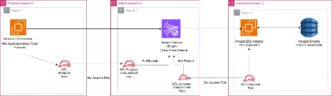

# Kinesis Cross-Account KPL/KCL Sample

This sample produces and consumes Amazon Kinesis Data Streams records across three AWS accounts using the [Kinesis Producer Library (KPL) 1.x](https://github.com/awslabs/amazon-kinesis-producer) and the [Kinesis Client Library (KCL) 3.x](https://github.com/awslabs/amazon-kinesis-client). It shows a **hybrid cross-account access pattern**: the producer assumes an IAM role in the stream account (KPL cannot target a stream ARN cross-account), while the consumer reads directly using the stream's resource-based policy (KCL 3.x supports cross-account stream ARNs natively).

## Architecture



- **Account A (Producer)** runs the KPL application on an EC2 instance.
- **Account B (Stream)** owns the Kinesis Data Stream, the KMS key, and the cross-account access policies.
- **Account C (Consumer)** runs the KCL application on an EC2 instance.

| Component | Account | Description |
|---|---|---|
| `KPLProducerRole` | A | EC2 instance profile; `sts:AssumeRole` on the single cross-account write role in B, plus CloudWatch. No direct KMS grant. |
| `KinesisProducerCrossAccountRole` | B | Assumable by A only with the matching external ID; grants stream write + KMS encrypt. |
| `StockTradeStream` | B | Kinesis Data Stream (2 shards by default), encrypted with a customer-managed KMS key. |
| `StreamKMSKey` | B | Customer-managed KMS key. Grants `kms:Decrypt` to Account C, constrained by `kms:ViaService` (see [Security](#security)). |
| `StreamResourcePolicy` / `EFOConsumer` | B | Resource-based policies granting Account C read (and EFO) access to the stream. |
| `KCLConsumerRole` | C | EC2 instance profile; scoped Kinesis read + DynamoDB + CloudWatch + KMS decrypt. |

### How the cross-account access works

```
KPL App (Account A)                              KCL App (Account C)
  └─ KPLProducerRole                               └─ KCLConsumerRole (local credentials)
       │                                                │
       ▼  sts:AssumeRole (+ external ID)                ▼  (identity-based policy)
       KinesisProducerCrossAccountRole           kinesis:GetRecords ◄──────────
       (Account B)                                      │
       │                                     StockTradeStream (Account B)
       ▼  (assumed credentials)              ┌──────────────────────────────────────┐
       kinesis:PutRecords ──────────►        │  Resource-Based Policy:               │
                                             │    Allow Account C: GetRecords, etc.  │
                                             └──────────────────────────────────────┘
```

- **Producer (A → B):** the KPL app runs as `KPLProducerRole`, assumes `KinesisProducerCrossAccountRole` in B using a non-guessable external ID (from `KINESIS_EXTERNAL_ID`), and writes with the assumed credentials. The external ID mitigates the [confused-deputy problem](https://docs.aws.amazon.com/IAM/latest/UserGuide/confused-deputy.html); use a unique value per deployment, never a hardcoded one.
- **Consumer (C → B):** the KCL app runs as `KCLConsumerRole` and calls `GetRecords` with its **local credentials** — no role assumption. The stream's resource-based policy in B authorizes the request; lease tables and metrics stay in C.

The stream is encrypted with a customer-managed KMS key (required for cross-account SSE — AWS managed keys cannot be shared across accounts). See [Security](#security) for the two-gate access model.

## Prerequisites

- Three AWS accounts (A producer, B stream, C consumer), each able to create the resources its stack defines (Kinesis, KMS, IAM, EC2, CloudFormation; the consumer stack also grants DynamoDB for the runtime lease table).
- AWS CLI configured with a named profile per account.

The EC2 instances install their own toolchain (Java 21 Corretto, Maven, Git) via user data, so you do not need Java or Maven locally. Library versions: **KPL 1.0.7**, **KCL 3.5.0**, **AWS SDK for Java 2.28.0**.

## Deployment

Deploy the three stacks in order, passing outputs from one to the next.

### Step 1 — Stream stack (Account B)

```bash
aws cloudformation deploy \
  --template-file cloudformation/stream-account-stack.yaml \
  --stack-name kinesis-cross-account-stream \
  --parameter-overrides \
      ProducerAccountId=<ACCOUNT_A_ID> \
      ConsumerAccountId=<ACCOUNT_C_ID> \
      ExternalId=<A_UNIQUE_NON_GUESSABLE_VALUE> \
  --capabilities CAPABILITY_NAMED_IAM \
  --profile <account-b-profile>
```

`ExternalId` is a non-guessable secret (for example `openssl rand -hex 24`); pass the same value to the producer via `KINESIS_EXTERNAL_ID` in Step 4. Then capture the outputs — `ProducerCrossAccountRoleArn` for Step 2; `StreamArn`, `EFOConsumerArn`, `KMSKeyArn` for Step 3; `StreamArn` again for Step 4:

```bash
aws cloudformation describe-stacks --stack-name kinesis-cross-account-stream \
  --query "Stacks[0].Outputs" --profile <account-b-profile>
```

### Step 2 — Producer stack (Account A)

```bash
aws cloudformation deploy \
  --template-file cloudformation/producer-account-stack.yaml \
  --stack-name kinesis-cross-account-producer \
  --parameter-overrides ProducerCrossAccountRoleArn=<from Step 1> \
  --capabilities CAPABILITY_NAMED_IAM \
  --profile <account-a-profile>
```

### Step 3 — Consumer stack (Account C)

```bash
aws cloudformation deploy \
  --template-file cloudformation/consumer-account-stack.yaml \
  --stack-name kinesis-cross-account-consumer \
  --parameter-overrides \
      StreamArn=<from Step 1> \
      EFOConsumerArn=<from Step 1> \
      KMSKeyArn=<from Step 1> \
  --capabilities CAPABILITY_NAMED_IAM \
  --profile <account-c-profile>
```

### Step 4 — Build and run on each instance

Connect via SSM Session Manager (no key pair needed), using the instance IDs from the Step 2/3 stack outputs:

```bash
aws ssm start-session --target <ProducerInstanceId> --profile <account-a-profile>
aws ssm start-session --target <ConsumerInstanceId> --profile <account-c-profile>
```

On the **producer instance** (`KINESIS_EXTERNAL_ID` must match the `ExternalId` from Step 1):

```bash
git clone https://github.com/aws-samples/sample-kinesis-cross-account-kpl-kcl.git
cd sample-kinesis-cross-account-kpl-kcl/producer
mvn clean package -q
KINESIS_EXTERNAL_ID=<the-value-from-step-1> \
  java -jar target/cross-account-kpl-producer-1.0.jar <StreamArn> <region> <ProducerCrossAccountRoleArn>
```

On the **consumer instance** (polling mode):

```bash
git clone https://github.com/aws-samples/sample-kinesis-cross-account-kpl-kcl.git
cd sample-kinesis-cross-account-kpl-kcl/consumer
mvn clean package -q
java -jar target/cross-account-kcl-consumer-1.0.jar <StreamArn> <region> StockTradeConsumer
```

For **Enhanced Fan-Out** (dedicated 2 MB/s per consumer, lower latency), pass `--efo` with the pre-registered consumer ARN and a separate application name so lease tables do not collide:

```bash
java -jar target/cross-account-kcl-consumer-1.0.jar <StreamArn> <region> StockTradeConsumerEFO --efo <EFOConsumerArn>
```

> With resource-based policies, KCL **cannot auto-register** stream consumers cross-account — the stream owner (Account B) pre-registers the EFO consumer in the stream stack, and you pass the resulting `EFOConsumerArn` to the app.

As native KCL 3.x, a new application uses the [single table format](https://docs.aws.amazon.com/amazondynamodb/latest/developerguide/kcl-single-table-format.html) automatically: one DynamoDB table per application name (holding lease, worker-metrics, and coordinator-state entries), instead of the three tables earlier KCL 3.x versions create.

### Implementation notes

A few non-obvious details specific to the cross-account setup:

| Item | Detail |
|---|---|
| Producer credentials | `StsAssumeRoleCredentialsProvider` (assumed role in B); refreshes automatically for the long-running producer. |
| Consumer credentials | `DefaultCredentialsProvider` (local Account C creds); the stream resource policy authorizes the read. |
| `ConfigsBuilder` | Use the `Arn` overload — required for cross-account stream access in KCL 3.x. |
| `addUserRecord` first arg | Stream **name**, not ARN — KPL 1.x resolves the ARN internally. |

Tuning defaults (batching, aggregation, poll interval, checkpoint interval, metrics level) are set in code with inline comments explaining the throughput/latency/cost trade-offs.

## Cleanup

Deploying this sample creates billable resources (a 2-shard stream, two `t3.medium` EC2 instances, a customer-managed KMS key, and a DynamoDB lease table). Delete the stacks in reverse order when done:

```bash
aws cloudformation delete-stack --stack-name kinesis-cross-account-consumer --profile <account-c-profile>
aws cloudformation delete-stack --stack-name kinesis-cross-account-producer --profile <account-a-profile>
aws cloudformation delete-stack --stack-name kinesis-cross-account-stream   --profile <account-b-profile>
```

> The KCL lease table (`StockTradeConsumer`, plus `StockTradeConsumerEFO` if you ran EFO) is **not** managed by CloudFormation — delete it manually.

## Security

This is sample code demonstrating a cross-account access pattern. It is **not** production-hardened — review and adapt the IAM, KMS, and network configuration for your own security, compliance, and operational requirements before any production use. Least-privilege practices already applied (preserve them):

- **Two-gate cross-account access, not a blanket account grant.** The stream, EFO, and KMS policies grant to Account C at the account level — because KMS and Kinesis validate that a named principal exists when the policy is written, and the consumer role is created later in a separate account, so it cannot be named here. Principal- and resource-level scoping is enforced by `KCLConsumerRole`'s **identity policy** (specific stream/EFO/key ARNs, read-only), and the KMS grant is further constrained by `kms:ViaService: kinesis.<region>.amazonaws.com`. Access requires *both* gates. To name the exact role ARN in the resource/key policies instead, pre-create `KCLConsumerRole` before the stream stack.
- **Producer `sts:AssumeRole` is scoped to the single cross-account role ARN** (not `"*"`) and gated by a non-guessable **external ID** (read from `KINESIS_EXTERNAL_ID`, never hardcoded) to mitigate the confused-deputy problem.
- **The producer role holds no direct KMS permission** — server-side encryption runs under the role assumed in Account B, keeping KMS access delegated to IAM in the key-owning account.
- **The only AWS-managed policy on the EC2 roles is `AmazonSSMManagedInstanceCore`**, solely for Session Manager (no inbound SSH or key pair).

When adapting for production, also review shard count, instance types, and network placement, and consider tightening the cross-account trust policy from account root to the specific producer role ARN.

See [CONTRIBUTING](CONTRIBUTING.md#security-issue-notifications) for reporting security issues.

## Contributing

See [CONTRIBUTING](CONTRIBUTING.md).

## License

Licensed under the MIT-0 License. See the [LICENSE](LICENSE) file.
